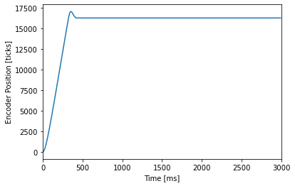
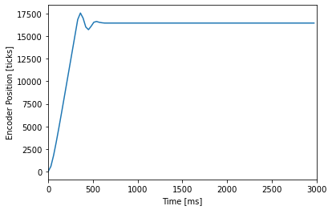

# Lab 3: "On schedule":Co-operative Multi-tasking to Control DC Motors

Group: Mecha15
Sean Wahl, Nathan Dodd, Lewis Kanagy

## Overview

The files contained within this github repository are an analysis of a closed-loop motor control system and a step resposne analysis.

In a previous exercise, a closed-loop control system was created to control the postiion of a DC motor. It did so through a user input of a controller gain, K_p value and a desired setpoint
of the motor, in position. Different K_p values were tested and used to contorl the motor and the step-response of the motor plotted to compare results between values. 

In this exercise, previous code is used and placed into a real-time scheduler, allowing the program to perform multitasking. Multitasking is a concept in which the program is defined by discrete
tasks, all carrying out different functions to make up a final finished code. Carrying out certain portions of each task directly with small time intervals between each, giving the user the impression that each task is carried out simultaneously. 
The 2 tasks carried out by the program is the running and control of 2 separate DC motors. Each task can drive the motor, measure its position, run a controller, and display the results. This project allows to do this simultaneosuly for each.

Recorded below is an initial plot of a step response of a single motor, with a standard gain value, K_p = 0.15 and desired final position of 16,384, corresponding to one revolution. 

Figure 3.1. Motor step response with gain value, K_p = 0.15 and task period t = 10 ms. The best we were able to have the 
motor reach the setpoint without excessive oscillation or overshoot. 

Following the initial plot, the period between each task is increased in intervals of 10 ms up to 50 ms, then a jump to 100 ms between tasks, at which point the oscillation occuring is at a maximum. The oscillation occurs due to
the encoder not registering a value frequently enough to settle around the desired encoder reading.

Note: K_p and setpoint remained constant for the following graphs.

### Figures

Figure 3.2. Motor step response with task period t = 20 ms. Note the slighlty higher amplitude oscillation.

Figure 3.3. Motor step response with task period t = 30 ms. Note the higher amplitude oscillation.

Figure 3.4. Motor step response with task period t = 40 ms. Note the even higher amplitidue and oscillation.

Figure 3.5. Motor step response with task period t = 50 ms. Excessive oscillation due to high task period. 

Figure 3.6. Motor step response with task period t = 100 ms. Excessive oscillation due to high task period, response will not reach desired steady-state value. 